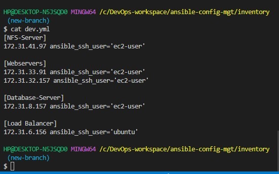
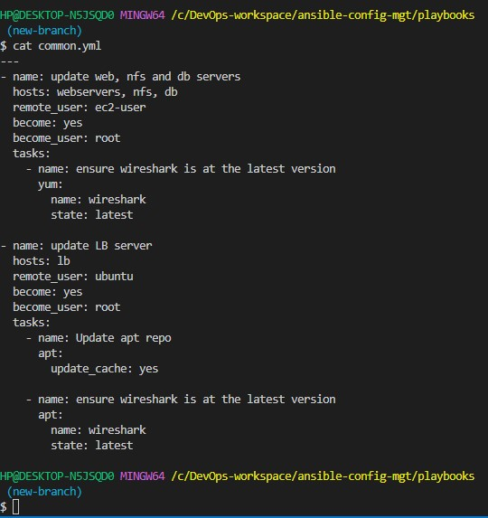
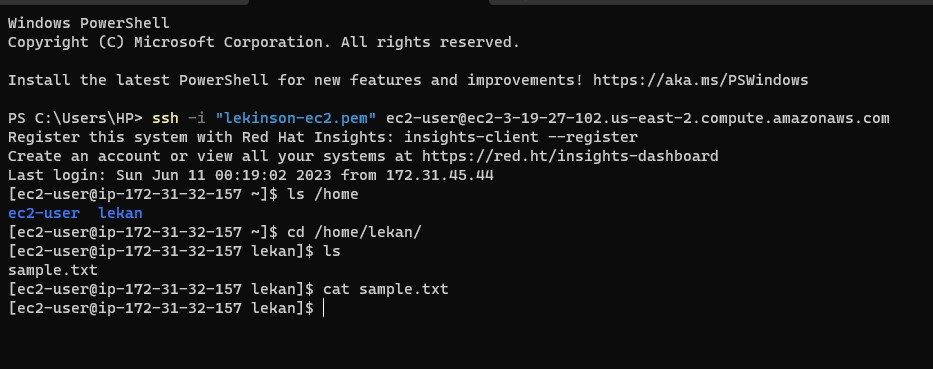
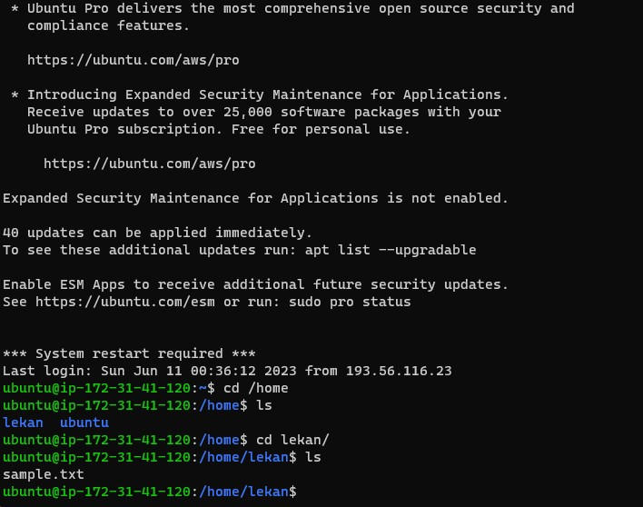

## ANSIBLE CONFIGURATION MANAGEMENT – AUTOMATE PROJECT 7 TO 10

### Project Architecture

### Task

- Install and configure Ansible client to act as a Jump Server/Bastion Host

- Create a simple Ansible playbook to automate servers configuration.

## INSTALL AND CONFIGURE ANSIBLE ON EC2 INSTANCE

1.  Update `Name` tag on your `Jenkins` EC2 Instance to `Jenkins-Ansible`. We will use this server to run playbooks.

    

2. In your GitHub account create a new repository and name it `ansible-config-mgt`.

3. Install Ansible

    `sudo apt update`

    `sudo apt install ansible`

    

    Check your Ansible version by running `ansible --version`

    

4.  Configure Jenkins build job to save your repository content every time you change it – this will solidify your Jenkins configuration skills acquired in Project 9.

- Create a new Freestyle project ansible in Jenkins and point it to your ‘ansible-config-mgt’ repository.

    

    

- Configure Webhook in GitHub and set webhook to trigger ansible build.

    

- Configure a Post-build job to save all (**) files, like you did it in Project 9.

    

5.  Test your setup by making some change in README.MD file in master branch and make sure that builds starts automatically and Jenkins saves the files (build artifacts) in following folder.

    

    

    `ls /var/lib/jenkins/jobs/ansible/builds/<build_number>/archive/`

    %20in%20following%20folder.png)

    ## Step 2 – Prepare your development environment using Visual Studio Code

1.  First part of ‘DevOps’ is ‘Dev’, which means you will require to write some codes and you shall have proper tools that will make your coding and debugging comfortable – you need an `Integrated development environment (IDE)` or `Source-code Editor`. There is a plethora of different IDEs and Source-code Editors for different languages with their own advantages and drawbacks, you can choose whichever you are comfortable with, but we recommend one free and universal editor that will fully satisfy your needs – [Visual Studio Code (VSC)](https://en.wikipedia.org/wiki/Visual_Studio_Code), you can get it [here](https://code.visualstudio.com/download).

2. After you have successfully installed VSC, configure it to connect to your [newly created GitHub repository](https://github.com/lekan675/ansible-config-mgt).

    Clone down your ansible-config-mgt repo to your Jenkins-Ansible instance

    `git clone https://github.com/lekan675/ansible-config-mgt.git`

    

## BEGIN ANSIBLE DEVELOPMENT

1. In my `ansible-config-mgt` GitHub repository, create a new branch that will be used for development of a new feature

2. Confirm my current branch using `git branch`

    

3. Create a new branch and switch to the new branch `git checkout -b name-of-the-new-branch`

    
    
    
    
4. Create a directory and name it **playbooks** – it will be used to store all my playbook files.

    `mkdir playbooks`

5. Create a directory and name it **inventory** – it will be used to keep my hosts organised.

    `mkdir inventory`

    

    
6. Within the **playbooks** folder, I'll create my first playbook file, and name it **common.yml**

    `cd playbooks`

    `touch common.yml`

7. Within the **inventory** folder, i'll create an inventory file (.yml) for each environment (Development, Staging Testing and Production) **dev, staging, uat, and prod** respectively.

    `cd inventory`

    `touch dev.yml staging.yml uat.yml prod.yml`

    
    
## Step 4 – Set up an Ansible Inventory

**Note**: Ansible uses TCP port 22 by default, which means it needs to `ssh` into `target servers` from `Jenkins-Ansible` host – for this need to import the `.pem key` into the `ssh-agent`. 

#### Using command below, check the Agent id:
     eval `ssh-agent -s`

#### Add my .pem key
    ssh-add <path-to-private-key>

#### Confirm the key has been added

    ssh-add -l

Now, ssh into `Jenkins-Ansible` server using ssh-agent

`ssh -A ubuntu@public-ip`

Also notice, that the Load Balancer user is `ubuntu` and user for RHEL-based servers is `ec2-user`.

So, update the inventory/dev.yml file with this snippet of code:

    [nfs]
    <NFS-Server-Private-IP-Address> ansible_ssh_user='ec2-user'

    [webservers]
    <Web-Server1-Private-IP-Address> ansible_ssh_user='ec2-user'
    <Web-Server2-Private-IP-Address> ansible_ssh_user='ec2-user'

    [db]
    <Database-Private-IP-Address> ansible_ssh_user='ec2-user' 

    [lb]
    <Load-Balancer-Private-IP-Address> ansible_ssh_user='ubuntu'

## CREATE A COMMON PLAYBOOK

### Step 5 – Create a Common Playbook

- In **common.yml** playbook, I'll write the configuration to be repeatableand re-usable, and multi-task. 

    I'll update my **playbooks/common.yml** file with following code:

    ---
    - name: update web, nfs and db servers
      hosts: webservers, nfs, db
      remote_user: ec2-user
      become: yes
      become_user: root
      tasks:
        - name: ensure wireshark is at the latest version yum:
            name: wireshark
            state: latest

    - name: update LB server
      hosts: lb
      remote_user: ubuntu
      become: yes
      become_user: root
      tasks:
        - name: Update apt repo 
          apt: 
            update_cache: yes

        - name: ensure wireshark is at the latest version
          apt:
            name: wireshark
            state: latest
  

    This playbook is divided into two parts, each of them is intended to perform the same task: install [wireshark](https://en.wikipedia.org/wiki/Wireshark) utility (or make sure it is updated to the latest version) on my RHEL 8 and Ubuntu servers.

    It uses `root` user to perform this task and respective package manager: `yum` for `RHEL 8` and `apt` for `Ubuntu`.

## Step 6 – Update GIT with the latest code

Now all of my directories and files live on my machine and I need to push changes made locally to GitHub.

Commit my code into my GitHub branch (new-branch)

1. Use git commands to add, commit and push your branch to GitHub.

    `git status`

    `git add .`

    `git commit -m 'new update'`

    `git push origin new-branch`

    

2. Create a pull request for branch (new-branch). Then merge the code in new-branch into the master branch

    

    

3. Since branch (new-branch) has been merged to main branch, code changes will now appear in master/main branch

    

    After the successful merge, **Jenkins** will automatically do its **job** and create a **build**

    

    **Jenkins** will save all the files **(build artifacts)** to `ls /var/lib/jenkins/jobs/ansible/builds/<build_number>/archive/` directory on **Jenkins-Ansible server**.

    %20.jpg)

    ## RUN FIRST ANSIBLE TEST

    ## Step 7 – Run first Ansible test

    Now, it is time to execute `ansible-playbook` command and verify if your playbook actually works:

    `cd ansible-config-mgt`

    

  
    *I was getting error below when trying to connect remotely. So, I added the .pem key again*

    

    

      `ansible-playbook -i inventory/dev.yml playbooks/common.yml`
            
    

    Check if `wireshark` has been installed by running `which wireshark` or `wireshark --version`

    *LB-Server*

    

    *NFS-Server*

    

    The updated with Ansible architecture now looks like this:

    

## Optional step – Repeat once again

Update the ansible playbook with some new Ansible tasks and go through the full

- Create a directory **"lekan"** and a file **"sample.txt"** inside it

- Change **timezone** on all servers

        - name: create directory, file and set timezone on all servers
          hosts: webservers, nfs, lb, db
          become: yes
          tasks:

            - name: create a directory
              file:
                path: /home/kris_folder
                state: directory

            - name: create a file
              file:
                path: /home/kris_folder/ansible.txt
                state: touch

            - name: set timezone
              timezone:
                name: Africa/Lagos
    
    

After updating the ansible playbook with some new Ansible tasks, 

`git status > git pull > git add . > git commit > git push origin new-branch`

 I'll initiate the full checkout -> change codes -> commit -> PR -> merge -> build -> ansible-playbook

On the new-branch

Navigate to the servers and confirm that the task in play book has been created in each of the servers.

